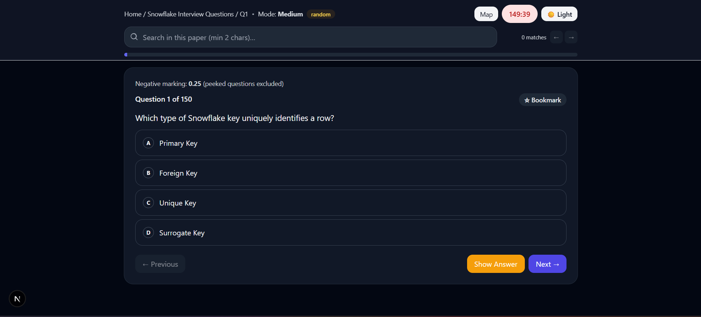

# MCQ Quickstart — Multi‑Tenant MCQ App with AI Generator

A production‑ready Next.js app for creating, practicing, and sharing multiple‑choice questions across tenants (IT, Nursing). Includes an AI MCQ Generator (image / prompt / PDF), a shared AI Library, resilient quiz engine with local session resume, and score history via API.


## Table of Contents
- [Overview](#overview)
- [Screenshots](#screenshots)
- [Features](#features)
- [Getting Started](#getting-started)
- [Environment Variables](#environment-variables)
- [Project Structure](#project-structure)
- [Data Model (Questions)](#data-model-questions)
- [Add or Edit Papers](#add-or-edit-papers)
- [AI MCQ Generator](#ai-mcq-generator)
- [AI Library](#ai-library)
- [Quiz Engine](#quiz-engine)
- [Score History API](#score-history-api)
- [Database Setup](#database-setup)
- [Deployment](#deployment)
- [SEO & Sitemaps](#seo--sitemaps)
- [Troubleshooting](#troubleshooting)
- [Contributing](#contributing)

## Overview
- Multi‑tenant (IT and Nursing) MCQ practice app
- Question sets as plain JSON files, plus community papers stored in Postgres
- AI generation (Gemini) from image, prompt/topic, or PDF
- Strong UX: editing/previewing AI output, map/search/peek during quiz, session resume

## Screenshots


- Home: 
- Quiz: 
- AI Generator: 
- AI Edit: 
- AI Preview: 
- AI Library: 
- Scores: 

## Features
- Multi‑tenant branding and paper registry (IT/Nursing)
- JSON‑backed papers with negative marking configuration
- AI MCQ Generator (Gemini) from image / prompt / PDF
  - Inline editor for text/options/answer/explanation
  - Preview mode to test MCQs before saving
  - Save to Community → shareable `db:<id>` quiz link
- AI Library
  - Browse community papers by tenant; search and filter “My papers”
  - Client‑side caching (list ~10 min, previews ~24h) to reduce API cost
  - Quick actions: Preview, Take Test, Copy Link
- Quiz engine
  - Timer, map, search, bookmarks, peek (excludes from score)
  - Stable order and session resume (7‑day validity)
- Score history
  - API saves `{ userId, paper, score, meta }` (Postgres)
  - “My Scores” table shows friendly paper names and timestamps
- SEO using `next-seo` + JSON‑LD (per paper) + `next-sitemap`

## Getting Started
1) Install

```bash
npm install
```

2) Dev server

```bash
npm run dev
```

3) Build + start

```bash
npm run build
npm start
```

## Environment Variables
Put these in `.env.local`:

- NEXT_PUBLIC_TENANT = `it` | `nursing`
- NEXT_PUBLIC_SITE_URL = `https://your-canonical.example`
- NEXT_PUBLIC_SITE_NAME, NEXT_PUBLIC_TAGLINE, NEXT_PUBLIC_PRIMARY_KEYWORDS
- NEXT_PUBLIC_GA_MEASUREMENT_ID (optional)
- NEXT_PUBLIC_GSC_VERIFICATION (optional)
- GEMINI_API_KEY = your Google Gemini API key (server‑side)
- Postgres (Vercel Postgres/Neon). Any of the following are supported by `@vercel/postgres`:
  - POSTGRES_URL (recommended)
  - POSTGRES_PRISMA_URL
  - POSTGRES_URL_NON_POOLING

Tip: For Neon, you may also have compatible aliases (DATABASE_URL, etc.). The code detects `POSTGRES_*` first.

## Project Structure
- `pages/`
  - `_app.jsx`, `_document.jsx`: global styles, base HTML
  - `index.jsx`: Home with tabs (Take Quiz, Scores, AI Generator, AI Library)
  - `quiz.jsx`: Quiz engine (timer, search, map, bookmarks, peek, scoring)
  - `papers/[id].jsx`: SSG SEO pages per paper
  - `api/*.js`: Scores + AI + community paper endpoints
- `components/`: Quiz UI, AI components, library, result summary
- `data/`: paper registry, config (modes, negative mark), sample questions
- `lib/`: site config, Postgres helpers, score store
- `public/questions/**.json`: question sets
- `styles/`, `tailwind.config.js`: styling

## Data Model (Questions)
Two supported shapes:

- Array of questions
- Object with `questions: []`

Each item:
```json
{
  "id": 1,
  "text": "Which keyword defines a function in Python?",
  "options": ["func","def","function","lambda"],
  "answerIndex": 1,
  "explanation": "Functions are defined using the def keyword.",
  "tags": ["python","basics"]
}
```

## Add or Edit Papers
1. Create/modify JSON under `public/questions/...`
2. Add entry in `data/paperList.js` with `{ tenant, id, name, file }`
3. Optional per‑paper negative mark in `data/papers.config.js`

Community papers (AI Library) are stored in Postgres. After saving via AI Generator, share the link `~/quiz?paper=db:<id>`.

## AI MCQ Generator
- Sources: Image, Prompt/Topic, PDF
- Flow: Generate → Edit (inline) → Preview (test) → Save to Community
- Server API: `POST /api/generate-mcq`
  - Only returns JSON MCQ shape; invalid questions are filtered out
- Client autosaves a draft to `localStorage` (`ai_mcq_draft`)

## AI Library
- Lists shared papers for the active tenant
- Search by name/author; “My papers” filter uses your User ID
- Preview is cached per paper for 24h; list is cached for 10 min
- Actions: Preview / Take Test / Copy Link

## Quiz Engine
- Session keys: `mcq_session:${userId}:${paper}:${mode}:${random}`
- Resume logic validates signature, length, and age (< 7 days)
- Negative marking taken from `data/papers.config.js`
- Peeked questions count toward total; no negative marking

## Score History API
- Save: `POST /api/save-score` → `{ userId, paper, score, meta }`
- Get: `GET /api/get-scores?userId=...` → `{ rows: [...] }`
- `meta.paperName` is stored so “My Scores” shows a friendly paper name
- DB tables are auto‑created on first write/read

## Database Setup
- Install and set `POSTGRES_URL` (Vercel Postgres/Neon recommended)
- Tables auto‑created:
  - `scores(user_id, paper, score, meta, ts)` with index on `user_id`
  - `papers(id, tenant, name, created_by, questions_json, created_at)`

## Deployment
- Vercel: push to GitHub and import
- Set environment variables for production
- Serverless note: built‑in JSON file writes are not used for scores (Postgres is used); AI generation and community papers depend on Postgres + Gemini

## SEO & Sitemaps
- Default SEO in `next-seo.config.js`
- Per‑paper JSON‑LD in `pages/papers/[id].jsx`
- `next-sitemap` runs on `postbuild` to generate sitemaps/robots.txt

## Troubleshooting
- “No scores yet”: ensure User ID is set; shared links add `?userId=` or the quiz will prompt and save it to local storage
- AI Library calling APIs repeatedly: list and preview use localStorage caches with TTLs; use the Refresh button to force fetch if needed
- Gemini errors: verify `GEMINI_API_KEY` is set and API not rate‑limited
- Postgres errors: verify `POSTGRES_URL` and DB permissions; tables are created automatically

## Contributing
- See `CONTRIBUTING.md` for guidelines
- PRs welcome for new papers, UI polish, question sources (PDF/OCR tuning), or additional tenants

---

Copyright © [THEBRCHUB](https://www.thebrchub.tech/).

