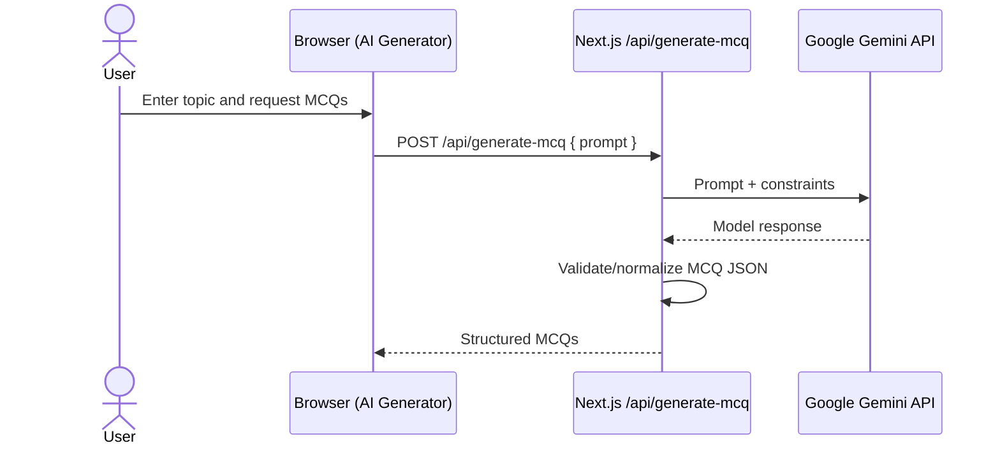
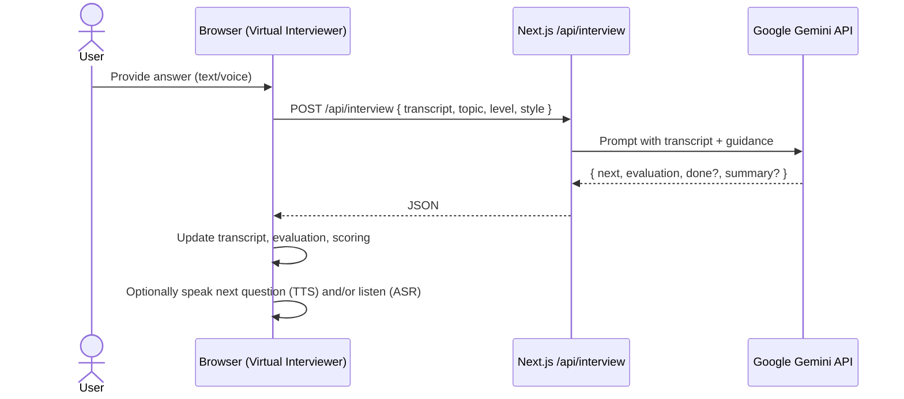
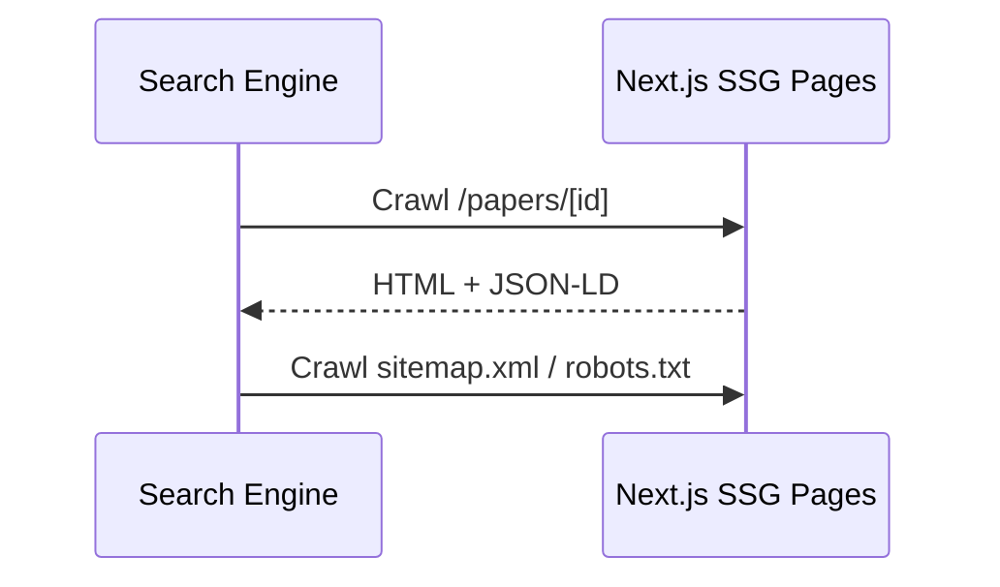

# C4 — Key Scenarios (Sequences)

The following flows illustrate how major features interact across containers.

## 1) Start a Quiz and Save Score

```mermaid
sequenceDiagram
  actor User
  participant UI as Browser (Quiz Page)
  participant API as Next.js API
  participant FS as scoreHistory.json

  User->>UI: Select paper and start quiz
  UI->>UI: Load /questions/*.json
  UI->>UI: Start timer; persist session to localStorage
  UI->>API: POST /api/save-score (on completion)
  API->>FS: Append row
  API-->>UI: 200 OK
  UI->>API: GET /api/get-scores?userId=...
  API-->>UI: Matching rows
```

## 2) AI MCQ Generation



## 3) Virtual Interview Turn



## 4) SEO Crawling



## Notes
- Voice features are optional; text input and standard navigation remain primary.
- Error handling includes safe fallbacks and clear user feedback banners.

