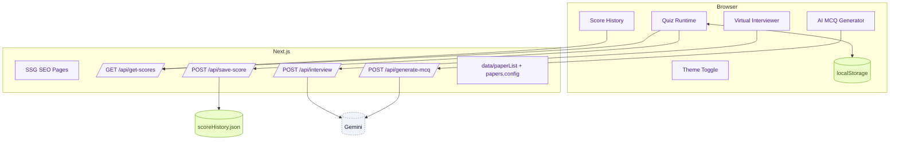
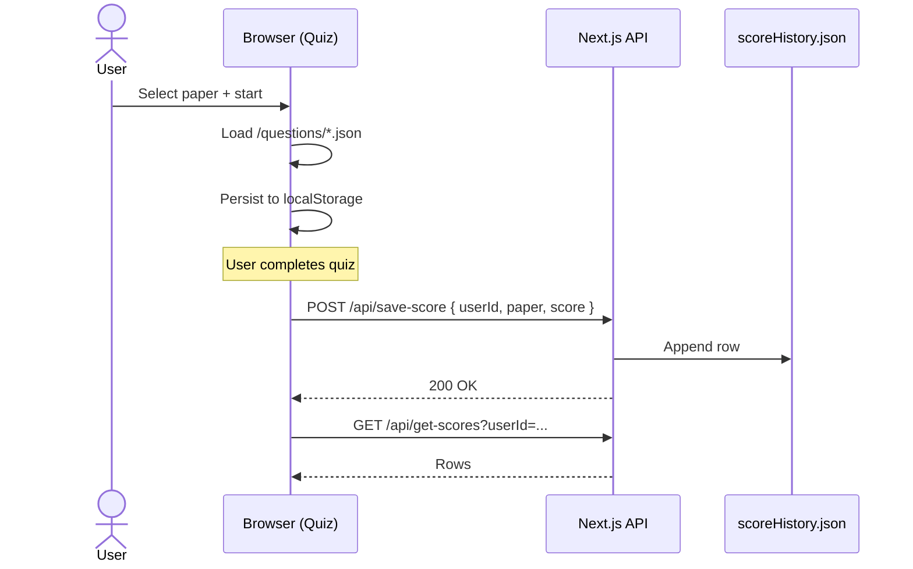
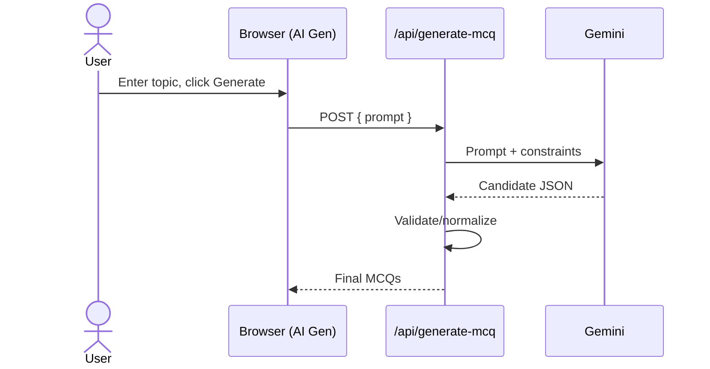
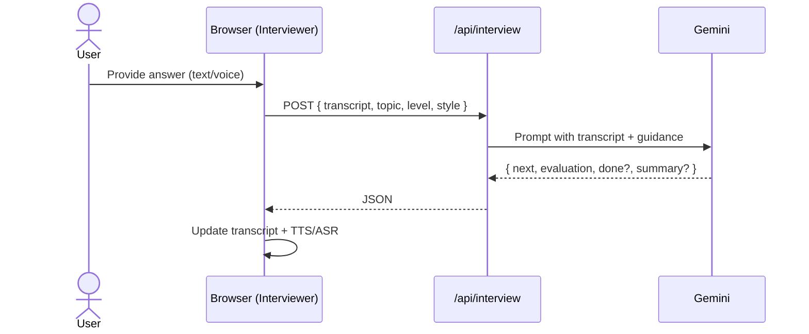

# C4 Model — Visual Diagrams (Mermaid)

This page presents the C4 levels using Mermaid so you can view them inline (in-app at `/docs/c4/visual` or in VS Code with a Mermaid preview).

Reference: https://c4model.com/

---

## Level 1 — System Context

```mermaid
flowchart TB
  classDef person fill:#fef3c7,stroke:#d97706,color:#92400e;
  classDef system fill:#e0e7ff,stroke:#4338ca,color:#1e3a8a;
  classDef ext fill:#eef2ff,stroke:#94a3b8,color:#0f172a,stroke-dasharray: 3 3;

  user([Candidate]):::person
  se[(Search Engines)]:::ext
  ga[(GA4)]:::ext
  ai[(Google Gemini API)]:::ext
  fs[(scoreHistory.json)]:::ext
  ls[(localStorage)]:::ext

  subgraph System[MCQ App (Next.js)]
    web[Web App (SSR/SSG + SPA)]:::system
    api[/API Routes/]:::system
  end

  user -->|Uses| web
  web -->|Reads/Writes| ls
  web -->|Calls| api
  api -->|Append/Read Scores| fs
  api -->|AI Generation| ai
  se -->|Crawls| web
  web -->|Events| ga
```

---

## Level 2 — Containers

```mermaid
flowchart LR
  classDef container fill:#e0f2fe,stroke:#0369a1,color:#075985;
  classDef data fill:#ecfccb,stroke:#65a30d,color:#365314;
  classDef svc fill:#f1f5f9,stroke:#64748b,color:#0f172a,stroke-dasharray: 3 3;

  subgraph Browser
    UI[Next.js App (SPA)]:::container
    LS[(localStorage)]:::data
  end

  subgraph Server[Next.js]
    P[Pages (SSR/SSG)]:::container
    API[/API Routes/]:::container
  end

  DB[(data/scoreHistory.json)]:::data
  AI[(Google Gemini)]:::svc
  SE[(Search Engines)]:::svc
  GA[(GA4)]:::svc

  UI <--> P
  UI <--> API
  UI --> LS
  API --> DB
  API --> AI
  SE --> P
  UI --> GA
```

---

## Level 3 — Components (Logical)



---

## Sequences

### Start Quiz + Save Score



### AI MCQ Generation



### Virtual Interview Turn



---

Notes
- Mermaid approximates C4 shapes via colors/classes; semantics match C4 levels.
- For strict C4 notation (PlantUML C4), we can add Kroki/PlantUML pipelines or static PNGs.
